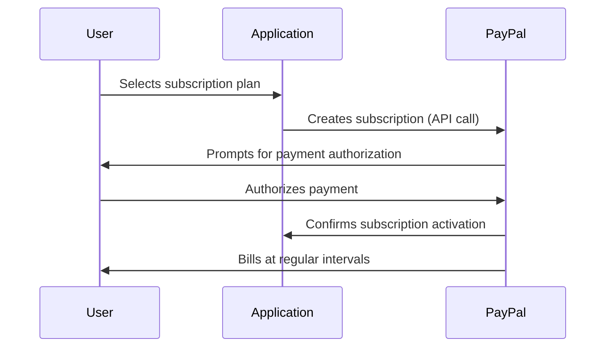

# Recurring-pay

## Overview

This repository demonstrates how to implement **PayPal Recurring Payment** functionality in your applications. Recurring payments allow merchants to automatically charge customers at regular intervals (e.g., weekly, monthly, yearly) for goods or services, making it ideal for subscription-based businesses.

PayPal supports recurring payments using its **Subscriptions API** and **Billing Agreements**. This repo provides code samples and guidance for integrating these features in your project.

---

## What are PayPal Recurring Payments?

**Recurring payments** (also known as subscriptions or automatic payments) enable a merchant to bill a customer periodically without requiring manual intervention from the customer each time. These are commonly used for:

- SaaS subscriptions
- Membership sites
- Digital magazines
- Streaming services
- Utility or insurance payments

---

## How PayPal Recurring Payments Work

1. **Customer Sign-Up:** The customer selects a plan and authorizes PayPal to make recurring payments.
2. **Merchant Setup:** Merchant creates a subscription plan via PayPal's API or dashboard.
3. **Payment Schedule:** PayPal automatically bills the customer at the defined frequency.
4. **Notifications:** Both merchant and customer receive notifications about payments, cancellations, and failed transactions.
5. **Management:** Customers can manage their subscriptions directly via PayPal.

---

## PayPal APIs for Recurring Payments

PayPal offers two main APIs for handling recurring payments:

### 1. Subscriptions API

- **Create Product:** Defines what you’re selling.
- **Create Plan:** Specifies pricing, frequency, and other details.
- **Activate Plan:** Makes the plan available for subscriptions.
- **Create Subscription:** Customer subscribes to the plan.

[PayPal Subscriptions API Docs](https://developer.paypal.com/docs/subscriptions/)

### 2. Billing Agreements (Legacy)

- Used with PayPal Express Checkout.
- Customer agrees to a billing agreement for regular payments.

[PayPal Billing Agreements Docs](https://developer.paypal.com/docs/archive/express-checkout/integration-guide/ECRecurringPayments/)

---

## Implementation Guide

### Prerequisites

- PayPal Business Account
- REST API credentials (Client ID and Secret)
- Sandbox environment for testing

### Steps

1. **Set up PayPal SDK:**  
   Install the PayPal SDK for your language (Node.js, Python, PHP, etc.).

2. **Create Product and Plan:**  
   Use the Subscriptions API to define your product and pricing plans.

3. **Integrate Subscription Creation:**  
   Implement checkout flow allowing users to subscribe and authorize recurring payments.

4. **Handle Webhooks:**  
   Set up PayPal Webhooks to receive notifications about payment events (e.g., successful payment, subscription cancelled).

5. **Manage Subscriptions:**  
   Allow customers to view, update, or cancel their subscriptions.

---

## Example Workflow



---

## Code Sample (Node.js)

```js
const paypal = require('@paypal/checkout-server-sdk');

const environment = new paypal.core.SandboxEnvironment('CLIENT_ID', 'CLIENT_SECRET');
const client = new paypal.core.PayPalHttpClient(environment);

async function createProduct() {
  // Create product logic
}

async function createPlan() {
  // Create plan logic
}

async function createSubscription() {
  // Create subscription logic
}
```

---

## Useful Resources

- [PayPal Subscriptions API Documentation](https://developer.paypal.com/docs/subscriptions/)
- [PayPal REST API Reference](https://developer.paypal.com/docs/api/overview/)
- [Official PayPal SDKs](https://developer.paypal.com/docs/api/rest-sdks/)

---

## Author

Payment Processed and Backended by Rahul V S


---

## License

This project is licensed under the MIT License.
